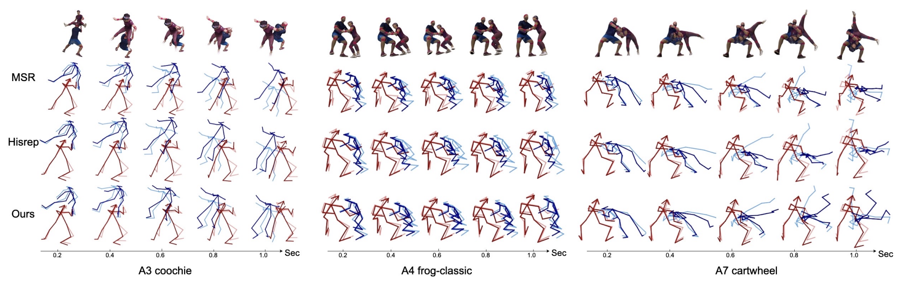
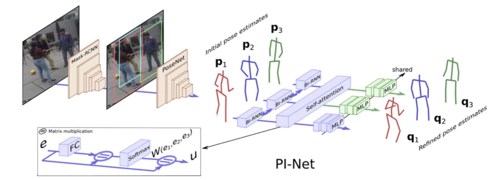
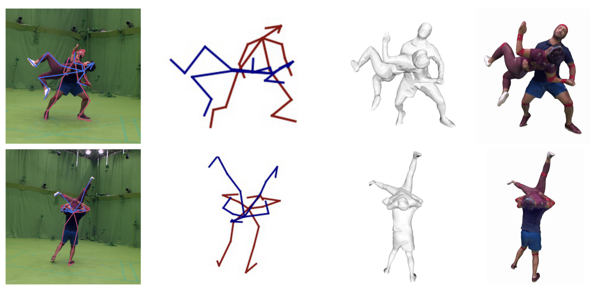

Ph.D. student at INRIA [RobotLearn team](https://team.inria.fr/robotlear) (former Perception team) supervised by [Xavier Alameda-Pineda](http://xavirema.eu/) and [Francesc Moreno-Noguer](http://www.iri.upc.edu/people/fmoreno/). 

Before that I got bachelor and master degree from Beihang University, and double degree from CentraleSupélec.

## News  
**07/2021** Present our ExPI dataset on poster session of PAISS summer school.  
**01/2021** Our paper "PI-Net: Pose Interacting Network for Multi-Person Monocular 3D Pose Estimation" accepted at WACV2021.  
**10/2020** Present on ACM MM'20 Doctoral Symposium.   

## Publications

Here is a selection of recent publications, full list can be found on [Google Scholar](https://scholar.google.com/citations?user=1fkvaz4AAAAJ&hl=fr).

<!-- 2021 arXiv ExPI-->
<article class="row">

  

    <figure class="image">
      
    </figure>
  

  

    <figure class="image">
      
    </figure>
  

  

    

      

        <b>Multi-Person Extreme Motion Prediction</b> 
        <b>Wen Guo</b>*, Xiaoyu BIE*, Xavier Alameda-Pineda, Francesc Moreno 
        <i>arXiv preprint arXiv:2105.08825.</i> 
        <a href="https://arxiv.org/abs/2105.08825" target="_blank">[Paper]</a>
        <a href="https://team.inria.fr/robotlearn/https://team.inria.fr/robotlearn/multi-person-extreme-motion-prediction" target="_blank">[Project page]</a>
        <a href="" target="_blank">[Code]</a> 
	<a href="https://team.inria.fr/robotlearn/research/expi-dataset/" target="_blank">[Dataset]</a>
      

    

  

</article>

<!-- 2021 wacv pi-net-->
<article class="row">
  

    <figure class="image">
      
    </figure>
  

  

    <figure class="image">
      
    </figure>
  

  

    

      

        <b>PI-Net: Pose Interacting Network for Multi-Person Monocular 3D Pose Estimation</b> 
	      <b>Wen Guo</b>, Enric Corona, Francesc Moreno-Noguer, Xavier Alameda-Pineda 
        <i>In Proceedings of the IEEE/CVF Winter Conference on Applications of Computer Vision (pp. 2796-2806).</i> 
        <a href="https://openaccess.thecvf.com/content/WACV2021/papers/Guo_PI-Net_Pose_Interacting_Network_for_Multi-Person_Monocular_3D_Pose_Estimation_WACV_2021_paper.pdf" target="_blank">[Paper]</a>
        <a href="https://team.inria.fr/robotlearn/pi-net-pose-interacting-network-for-multi-person-monocular-3d-pose-estimation/" target="_blank">[Project page]</a>
        <a href="https://github.com/GUO-W/PI-Net" target="_blank">[Code]</a>
      

    

  

</article>

<!-- 2020 acm mm ds-->
<article class="row">
  

    <figure class="image">
      
    </figure>
  

  

    <figure class="image">
      
    </figure>
  

  

    

      

        <b>Multi-person Pose Estimation in Complex Physical Interactions</b> 
	      <b>Wen Guo</b> 
        <i>In Proceedings of the 28th ACM International Conference on Multimedia (MM ’20). Association for Computing Machinery, New York, NY, USA, 4752–4755. DOI:https://doi.org/10.1145/3394171.3416519 (DS) </i> 
        <a href="https://dl.acm.org/doi/10.1145/3394171.3416519" target="_blank">[Paper]</a>
      

    

  

</article>

## Datasets
<!-- 2021 dataset ExPI-->
<article class="row">

  

    <figure class="image">
      
    </figure>
  

  

    <figure class="image">
      
    </figure>
  

  

    

      

        <b>Extreme Pose Interaction (ExPI) Dataset</b> 
        <a href="https://team.inria.fr/robotlearn/research/expi-dataset/" target="_blank">[Dataset]</a>
      

    

  

</article>

## Services
Reviewing for ACM MM'20-21, IJCV, ICPR'21, WACV'21, ACM TOMM.

## Contact
wen[dot]guo[at]inria[dot]fr

