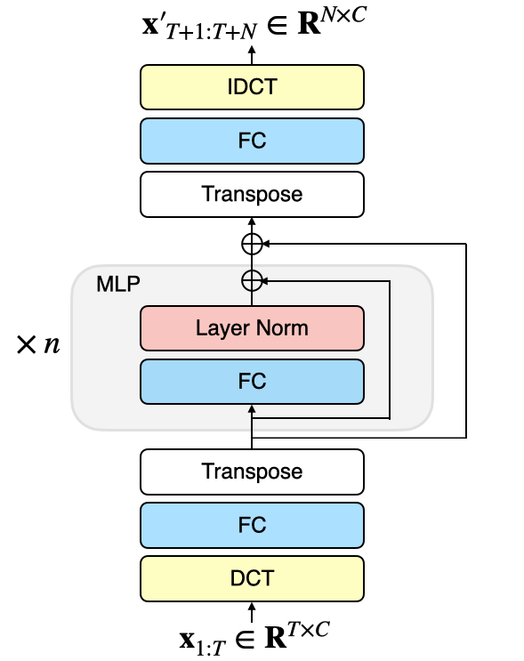
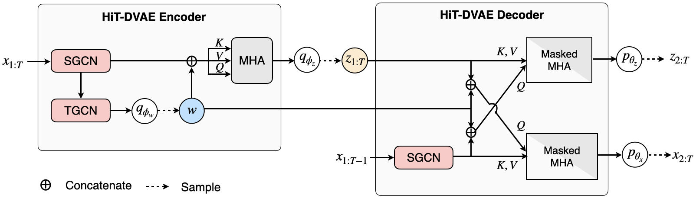
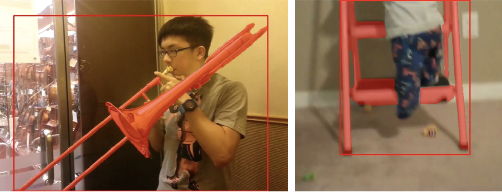
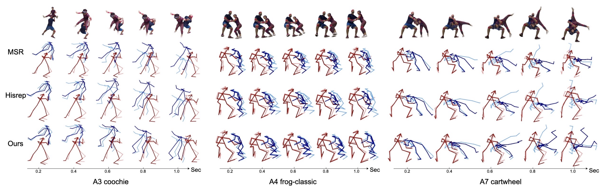
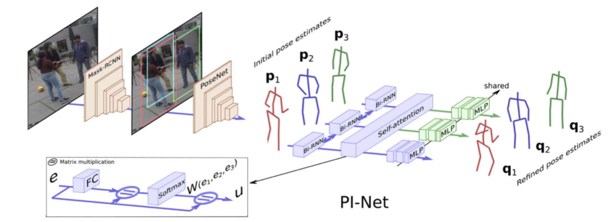
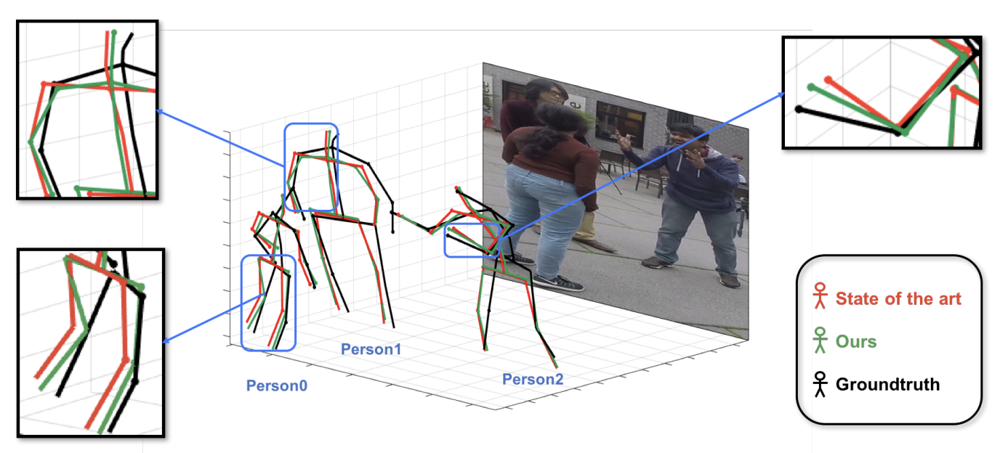

Ph.D. student at INRIA [RobotLearn team](https://team.inria.fr/robotlearn) (former Perception team) and IRI, supervised by [Dr.Xavier Alameda-Pineda](http://xavirema.eu/) and [Dr.Francesc Moreno-Noguer](http://www.iri.upc.edu/people/fmoreno/). 

Before that I got bachelor and master degree from Beihang University, and a double master degree from CentraleSupélec.

## News  
**12/2022** Given a talk at DLBCN, Barcelona.  
**08/2022** Our paper "Back to MLP: A Simple Baseline for Human Motion Prediction" accepted at WACV2023 first track.  
**03/2022** Our paper "Multi-Person Extreme Motion Prediction" accepted at CVPR2022.  
**10/2021** [ExPI Dataset](https://team.inria.fr/robotlearn/multi-person-extreme-motion-prediction) released.  
**10/2021** We win 1st place of [UVO Open-World Segmentation Challenge 2021](https://sites.google.com/view/unidentified-video-object/home), ICCV2021 (2/2 tracks), technical reports: [Track-1](https://arxiv.org/abs/2110.10239) and [Track-2](https://arxiv.org/abs/2110.11661).  
**07/2021** Present on poster session of PAISS summer school.  
**01/2021** Our paper "PI-Net: Pose Interacting Network for Multi-Person Monocular 3D Pose Estimation" accepted at WACV2021 first track.  
**10/2020** Present on ACM MM'20 Doctoral Symposium.   

## Publications

Here is a selection of recent publications, full list can be found on [Google Scholar](https://scholar.google.com/citations?user=1fkvaz4AAAAJ&hl=fr).

<!-- 2022 wacv  BackToMLP-->
<article class="row">
  

    <figure class="image">
      
    </figure>
  

  

    <figure class="image">
      
    </figure>
  

  

    

      

        <b>Back to MLP: A Simple Baseline for Human Motion Prediction</b> 
        <b>Wen Guo*</b>, Yuming Du*, Xi Shen, Vincent Lepetit, Xavier Alameda-Pineda, Francesc Moreno-Noguer 
        <i>WACV 2023.</i> 
        <a href="https://arxiv.org/abs/2207.01567" target="_blank">[paper]</a>
        <a href="https://github.com/dulucas/siMLPe" target="_blank">[Code]</a>
      

    

  

</article>

<!-- 2022 arXiv HiT DVAE-->
<article class="row">
  

    <figure class="image">
      
    </figure>
  

  

    <figure class="image">
      
    </figure>
  

  

    

      

        <b>HiT-DVAE: Human Motion Generation via Hierarchical Transformer Dynamical VAE</b> 
        Xiaoyu BIE*, <b>Wen Guo*</b>, Simon Leglaive, Laurent Girin, Francesc Moreno-Noguer, Xavier Alameda-Pineda 
        <i>arXiv preprint arXiv:2204.01565</i> 
        <a href="https://arxiv.org/abs/2204.01565" target="_blank">[paper]</a>
        [Code]
      

    

  

</article>

<!-- 2022 uvo-->
<article class="row">
 
  

    <figure class="image">
      
    </figure>
  

  

    <figure class="image">
      
    </figure>
  

 
  

    

      
 
        <b>1st Place UVO Open-World Segmentation Challenge Reports</b> 
        Yuming Du, <b>Wen Guo*</b>, Yang Xiao, Vincent Lepetit 
        <i>Tech Reports of ICCV 2021 UVO Challenge.</i> 
        <a href="https://arxiv.org/abs/2110.10239" target="_blank">[Image-track]</a>
		<a href="https://arxiv.org/abs/2110.11661" target="_blank">[Video-track]</a>
        <a href="https://github.com/dulucas/UVO_Challenge" target="_blank">[Code]</a> 
      

    

  

</article>

<!-- 2022 cvpr ExPI-->
<article class="row">

  

    <figure class="image">
      
    </figure>
  

  

    <figure class="image">
      
    </figure>
  

  

    

      

        <b>Multi-Person Extreme Motion Prediction</b> 
        <b>Wen Guo</b>*, Xiaoyu BIE*, Xavier Alameda-Pineda, Francesc Moreno 
        <i>CVPR 2022.</i> 
        <a href="https://arxiv.org/abs/2105.08825" target="_blank">[Paper]</a>
        <a href="https://team.inria.fr/robotlearn/multi-person-extreme-motion-prediction" target="_blank">[Project page]</a>
        <a href="https://github.com/GUO-W/MultiMotion" target="_blank">[Code]</a> 
	<a href="https://zenodo.org/record/5578329#.YbjaLPHMK3J" target="_blank">[Dataset]</a>
      

    

  

</article>

<!-- 2021 wacv pi-net-->
<article class="row">
  

    <figure class="image">
      
    </figure>
  

  

    <figure class="image">
      
    </figure>
  

  

    

      

        <b>PI-Net: Pose Interacting Network for Multi-Person Monocular 3D Pose Estimation</b> 
	      <b>Wen Guo</b>, Enric Corona, Francesc Moreno-Noguer, Xavier Alameda-Pineda 
        <i>WACV 2021.</i> 
        <a href="https://openaccess.thecvf.com/content/WACV2021/papers/Guo_PI-Net_Pose_Interacting_Network_for_Multi-Person_Monocular_3D_Pose_Estimation_WACV_2021_paper.pdf" target="_blank">[Paper]</a>
        <a href="https://team.inria.fr/robotlearn/pi-net-pose-interacting-network-for-multi-person-monocular-3d-pose-estimation/" target="_blank">[Project page]</a>
        <a href="https://github.com/GUO-W/PI-Net" target="_blank">[Code]</a>
      

    

  

</article>

<!-- 2020 acm mm ds-->
<article class="row">
  

    <figure class="image">
      
    </figure>
  

  

    <figure class="image">
      
    </figure>
  

  

    

      

        <b>Multi-person Pose Estimation in Complex Physical Interactions</b> 
	      <b>Wen Guo</b> 
        <i>ACM MM 2020 (DS).</i> 
        <a href="https://dl.acm.org/doi/10.1145/3394171.3416519" target="_blank">[Paper]</a>
      

    

  

</article>

## Datasets
<!-- 2021 dataset ExPI-->
<article class="row">

  

    <figure class="image">
      
    </figure>
  

  

    <figure class="image">
      
    </figure>
  

  

    

      

        <b>Extreme Pose Interaction (ExPI) Dataset</b> 
        <a href="https://team.inria.fr/robotlearn/multi-person-extreme-motion-prediction" target="_blank">[Dataset]</a> 
	It contains 115 sequences of exteme Lindy Hop poses, with 3D MoCap data (annotated from 20 mocap cameras and manual clean), multi-view images (68 views) and 3D shapes as texured meshes. Welcome to download the <a href="https://zenodo.org/record/5578329#.Ymv4R_VBy3J" target="_blank">[Data]</a>. 
      

    

  

</article>

## Services
Reviewing for CVPR, ECCV, ACM MM, ICPR, WACV, ACM TOMM, IJCV, TPAMI.

## Contact
wen[dot]guo[at]inria[dot]fr

